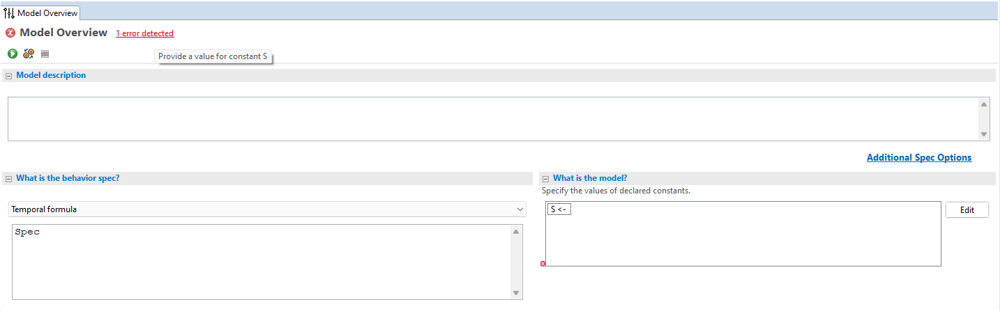
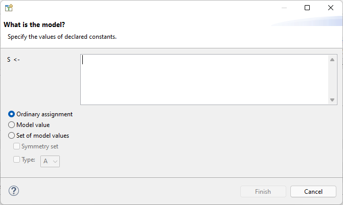

.. _chapter_constants:

###############
Constants
###############

- CONSTANTs
- ASSUME
- Model Values
- Instances?

.. index:: constants, CONSTANT

.. _constant:

CONSTANT
========

In the last chapter, we made a complete specification of the duplicate checker, adding a property to our implementation. By using initial states, we can check all 4-digit lists of single digits. If we wanted to be more thorough, we could check a wider range of inputs, for example ``S == 1..100``. By my estimate, this would kick the number of found states from 70,000 to about seven hundred million. That would take a lot more time to check! If we were writing this as a "real" spec, we'd want to do most of our writing with a smaller value of S, like ``1..10``, so we can get faster feedback from the model checker. It's only when we've shaken out the obvious issues that we'd switch a large value of S, like ``1..100``.

This means we don't want ``S`` to be a hardcoded value in the spec. It should instead be something we can dynamically pick per model run. Think of how, in a programming language, you have command line flags for passing in arguments. In TLA+, values that can be configured per model run are called "Constants". [#footnote-constant]_ Let's make ``S`` a constant:

.. spec:: duplicates/constant_1/duplicates.tla
  :diff: duplicates/inv_4/duplicates.tla

You can put several constants on the same line; when we make the length configurable (in the `next chapter <chapter_functions>`), we'll write ``CONSTANT S, Length``. If we now try to run our spec, the toolbox will say that we haven't defined the constant ``S``:

We do that over here:

.. image:: img/missing_constant_annotated.png

Which opens this box:

There are three options for constants: ordinary assignments, model values, and sets of model values. We'll talk about the other two later, for now let's just look at ordinary assignments. This lets you assign any valid TLA+ expression to the constant. Since showing screenshots of every single assignment is annoying, I'll write ``S <- 1..10`` to mean "we do an ordinary assignment of ``1..10`` to S." Now we can make separate models with a small ``S`` for iterative development and one with a large ``S`` for final testing.

.. todo:: It's good practice to use constants in your TLA+ specs. Generally I use .To keep the examples simple, though, I'll hardcode more values than I normally would.

.. index:: ASSUME
  
.. _ASSUME:

ASSUME
-------

Not all values of ``S`` are meaningful for our spec. For example, what if we do ``S <- {}``? Then there's no possible values for ``seq``, so there's no possible duplicates, so the entire model is pointless. Or what about ``S <- {1, 2}``? While there are now possible values of ``seq``, they will *always* contain duplicates, so running the spec isn't particularly interesting.

We can rule these pathological values out with the ``ASSUME`` keyword. ``ASSUME`` expressions are checks to make sure we put in correct constants.

.. spec:: duplicates/constant_2/duplicates.tla
  :diff: duplicates/constant_1/duplicates.tla

The ASSUME is checked before the model run even starts. If we try running the spec with ``S <- {1}``, we get an error:

| Error: Assumption %line% is false.

If you have a spec with constants, you should put constraining assumptions on them. In addition to preventing errors, they also help readers of the spec understand what the constants are supposed to be.

.. index:: Model Values

.. _model_values:

Model Values
----------------

That takes care of ordinary assignments, what about "model values"? Model values are a special type of value in TLA+. A model value has no operations and can only be tested for equality, and is only equal to itself. IE

.. code-block::

  X <- [model value]
  Y <- [model value]

  X = X
  X # Y
  X # 1
  X # "a"
  X # <<1, Y>>

Why would you want this? Because in TLC, comparing incompatible types produces an error. Say you want to represent a nullable value, like ``last_access_time``. You can't write ``IF last_access_time = "null"`` because if ``lat`` is non-null, then you're comparing a string to an integer, which is an error. If you use a sentinel value, like ``IF last_access_time = -1``, then you're risking logic errors if you accidentally use it in any other numerical context.

What you can do instead is define a new constant, like ``NULL`` or ``NoLastAccess``, and set it to a model value. Then you can do ``IF last_access_time = NULL``, which will be false if ``lat`` is already a number. Similarly, you can add them to sets that already have a Model values are incredibly useful as sentinel and placeholder values in organizing larger specs.

.. tip:: Once you have a model value, you can use it in ordinary assignments. For example:

  .. code-block::

    CONSTANT X, Set

    X <- [model value]
    Set <- {1, 2, X}

  Totally okay!

Compare false to everything BUT themselves, don't raise an error

replace the sentinel value in ``threads``

.. index::
  pair: Model values; sets of model values
  :name: model_set

Sets of Model Values
---------------------

.. todo:: explain better

We can also assign constants to sets of model values. Put it in as a normal set, but without quotes.

::

  S <- [model value] {s1, s2, s3, s4, s5}

Sets of model values will become *extremely* useful when we start modeling `concurrency <chapter_concurrency>`, but there's still one cool trick we can do with them right now. If you run the model with that value of ``S``, you will get 4,735 states total— the same as if you did ``S <- 1..5``...

But notice this other option below the "set of model values" bar:

.. image:: img/symmetry_set.png

.. index:: 
  pair: Model values; symmetry sets

"Symmetry set" is a special TLC optimization. In a symmetry set, {{TODO explain what exactly goes on}}. By making ``S`` a symmetry set, the number of states drops to only 715. Symmetry sets are a very powerful optimization technique!

.. todo:: 

.. warning:: Symmetry sets don't always make the spec run faster. TLC has some overhead in figuring out all the symmetries; with very large sets, that can take longer than actually checking the model. On my computer, checking ``duplicates`` with an 8-element symmetry set takes two minutes longer than checking it with a regular model set.

.. todo::

Advanced: Non-enumerable sets

Summary
===========

* `Constants <constant>` let you use different values of something for different models.
* Constants can be assigned ordinary TLA+ expressions, or model values or sets of model values.
* `ASSUME` checks that you assign meaningful values to your constants.
* Model values compare equal to themselves and nothing else. They are useful as sentinel values.
* Sets of model values can be made into symmetry sets, which (usually) speeds up model checking.

.. [#footnote-constant] This is different from how we use constant in programming languages, as well as other specification languages. AFAICT it's an idiosyncracy of TLA+. Constants as in "values that never change" are just 0-arity operators.
