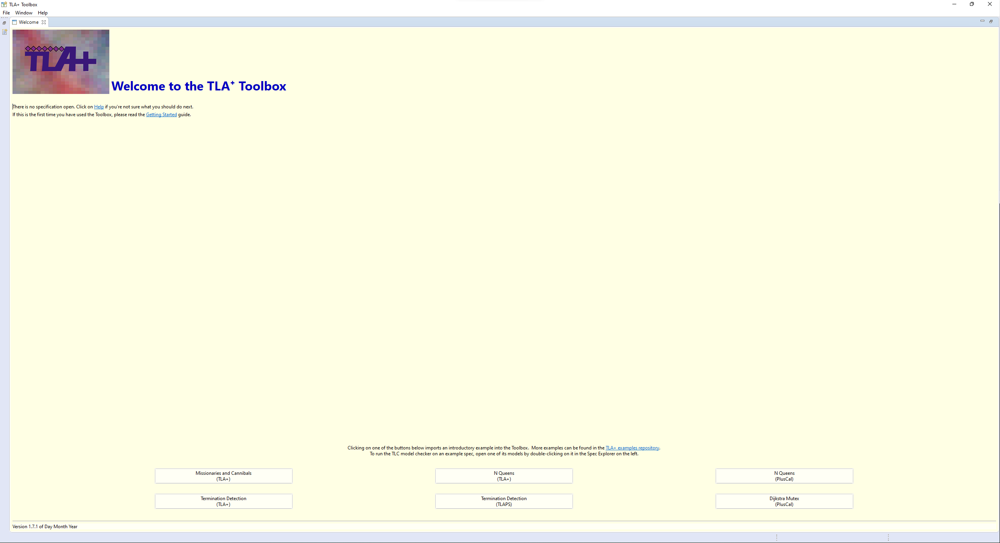
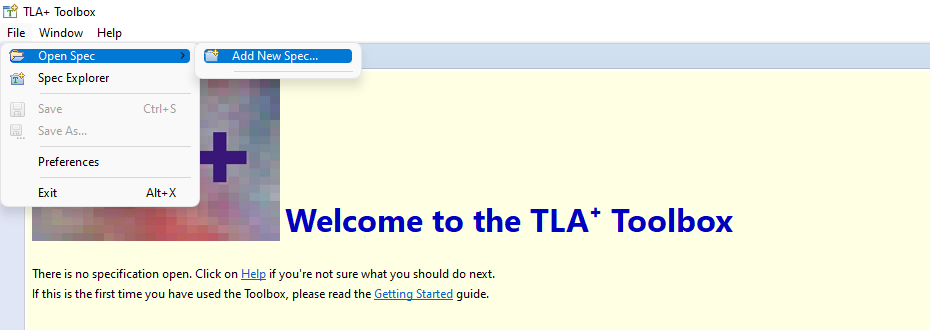
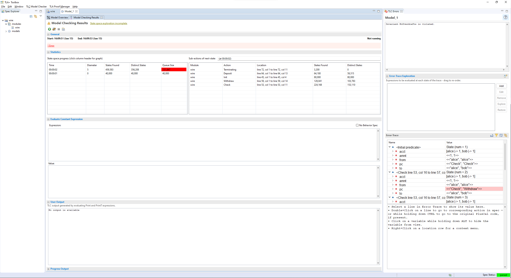

.. _setup:

+++++++
Setup
+++++++

This section is a quick introduction to setting up and running the tooling. We'll use the `wire <wire>` spec from the `chapter_overview`.

Setting Up a Project
=======================

For teaching purposes, I like to start people off using the TLA+ IDE. It abstracts out some parts of TLA+ that can be difficult for beginners. You can download the most recent version of the Toolbox `here <https://github.com/tlaplus/tlaplus/releases/tag/v1.8.0>`_. You will need Java for it to work.

Once you have the toolbox, you'll see an image like this:

Create a new specification under ``File > Open Spec > Add New Spec``.

.. figure:: img/setup/new_file.png

Once you do that, you should see something like this:

::

  ---- MODULE wire ----

  ====

For Historical Reasons, the ``MODULE $name`` must be surrounded by at least four dashes, the module must end with at least for equal-signs, and the ``$name`` of the module must match the filename (case sensitive). Everything above the module name and below the ``====`` is ignored, making those good places to store notes.

Let's replace it with the contents of `wire <wire>`, so you get this:

.. figure:: img/setup/wire_spec.png

(There should only be one ``MODULE`` row at the top and one ``====`` row at the bottom. Make sure to change the name of the module in the first line if you named your spec ``Wire.tla`` instead!)

Translating Specs
====================

As mentioned in the :doc:`core outline <index>`, we're going to be teaching pluscal. Translate it under ``File > Translate PlusCal Algorithm``.

.. figure:: img/setup/translate_pluscal.png

.. tip:: You can use the shortcut ctrl+T on Windows/Linux and cmd+T on Mac.

Once you do that, you should see this:

.. figure:: img/setup/translated_output.png

Running Models
====================

To actually check this with TLC, we have to create a new model to check. Do that under ``TLC Model Checker > New Model``.

.. figure:: img/setup/new_model.png

Once you do that, you should see this page:

.. 

1. "What is the behavior spec" should be "Temporal Formula" and "Spec". If it's not, make sure you have only one set of ``====`` in the spec, and the translated TLA+ is above it, then manually set the two fields.
2. Click the "Invariants" box to open it up.
3. Click "Add", and then insert the text ``No Overdrafts``.
4. Run the model, or press ``F11``

Error

Manual Outputs
====================

blah blah

.. _scratch:

Scratchfile
------------

Blah blah
