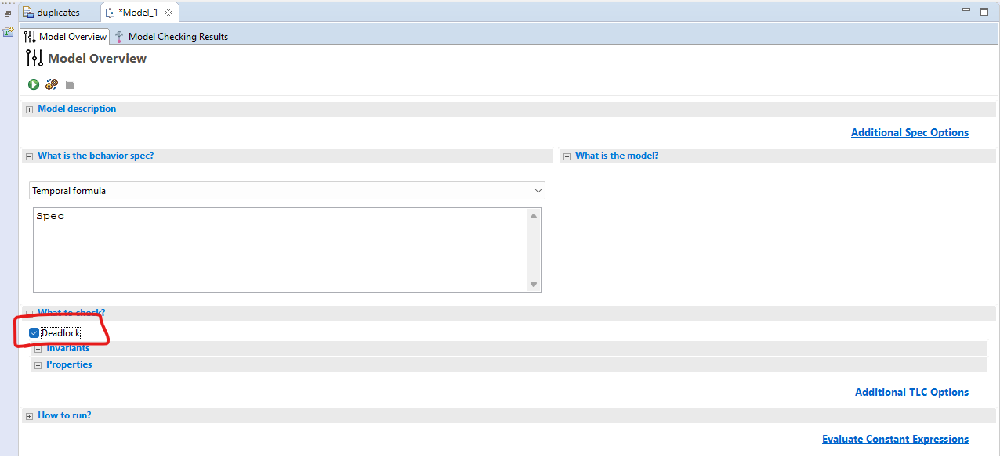

.. _chapter_concurrency:

################
Concurrency
################

So far we've only worked with single-process algorithms. But the selling point for formal methods is dealing with concurrency. Concurrency is both very common and very hard to reason about, so we get a tool to reason about it for us. A tool like TLA+!

.. index:: process
.. _process:

Processes
=============

Processes are the main agents of concurrency. They can represent different OS processes, or different threads, or different programs on different machines, or even different people. Let's start with one process.

.. spec:: reader_writer/1/reader_writer.tla
  :ss: rw_1

This is identical to no processes, except the ``end process``. Note it's assigned to a value, ``1``. This will be important later. 

Now let's add another process that reads from the queue.

.. spec:: reader_writer/2/reader_writer.tla
  :diff: reader_writer/1/reader_writer.tla
  :fails:

.. warning:: All processes must have comparable types: all integers, all strings, all sequences, etc. The one exception is that processes can also be `model values <model_values>`. 

  Different processes cannot share label names.

The writer has a single action, ``Write``, and the reader has a single action, ``Read``. We haven't specified which should happen first, so the two can happen in any order. Either we (1) write to the queue and then read from it, or (2) read from the queue and then write to it.

Behavior (2) doesn't make any sense: how can we read from the queue if there's nothing already in it? And if you try to run the spec, TLC will raise this as an error.

  | Error: TLC threw an unexpected exception.
  | This was probably caused by an error in the spec or model.
  | See the User Output or TLC Console for clues to what happened.
  | The exception was a tlc2.tool.EvalException
  | : Attempted to apply Head to the empty sequence.

.. digraph:: rw_error
  :caption: Reading before reading is ill-defined, so counts as an error.

  Init[label="<<>>"];
  Bad[label="!?", color=tomato];
  Good1[label="<<1>>"];
  Good2[label="<<>>"];
  Init -> Bad[label=Read];
  Init -> Good1[label="Write"];
  Good1 -> Good2[label="Read"];

It's an "unexpected exception", but it points to a real flaw in our system: we don't specify what should be possible in the case of attempting to read from an empty queue. There's a lot of different things we could *choose* to do:

* We could simply skip the dequeueing logic and continue the process.
* We could block the reader until the queue is nonempty.
* We could substitute in a default value.
* We could raise an error *as part of the system*, as opposed to having TLC treat it as a flaw in the system.

.. tip:: Regularly model check your specs, even if you haven't figured out your invariants yet. It's good to catch these kinds of ambiguous cases early.

The point is that we decide what's the right choice based on what we need from the system. For now, let's have the reader ignore empty queues, by wrapping the logic in an ``if`` block.

.. spec:: reader_writer/3/reader_writer.tla
  :diff: reader_writer/2/reader_writer.tla
  :name: rw_3
  :ss: rw_2

This passes.

.. digraph:: rw_good
  :caption: Now reading an empty queue is a noop, so the spec passes.

  Init[label="<<>>"];
  Nah1[label="<<>>"];
  Nah2[label="<<1>>"];
  Good1[label="<<1>>"];
  Good2[label="<<>>"];
  Init -> {Nah1}[label=Read];
  Init -> Good1[label="Write"];
  Good1 -> Good2[label="Read"];
  Nah1 -> Nah2[label="Write"];

.. rubric:: pc

In our single process specs, we used a string variable called `pc` ("program counter") to track the value. To model multiple processes, the translator "lifts" ``pc`` to be a function from process values to strings. So if you're writing an invariant that depends on the reader's current label, you can retrieve it with ``pc[0]``.

.. index:: process; local variables

local variables
-----------------

Let's modify the writer so it can write twice, instead of once.

.. spec:: reader_writer/rw_local_1/reader_writer.tla
  :diff: reader_writer/3/reader_writer.tla
  :ss: rw_local_1
  :name: rw_local_1

Notice how many more states we have. The ``while`` loop is nonatomic, and every iteration counts as a separate ``Write`` action. So there are now three possible orderings: Read-Write-Write, Write-Read-Write, and Write-Write-Read.

``i`` is only used in the writer, so we don't necessarily need to expose it to the reader. We can make a variable local to the process, like this:

.. spec:: reader_writer/rw_local_2/reader_writer.tla
  :diff: reader_writer/rw_local_1/reader_writer.tla
  :ss: rw_local_2

As with global variables, we can have multiple starting local variables— ``i \in 1..3`` is valid.

In practice, local variables aren't often used, as operators in `define <define>` blocks can't use them. This means you can't easily typecheck them, write helper operators, etc. Generally we use local variables as :ref:`auxiliary <topic_aux_vars>` or "bookkeeping" variables, like loop iterations and model bounding.

For now let's pull out the ``while`` loop and go back to our `previous version <rw_3>`.

.. index:: process; process sets

Process Sets
---------------------

Once we have a single process, we can extend it into a process set. Instead of saying ``process name = val``, we write ``process name \in val``. Then PlusCal will create one distinct process for *each* value in the set.

.. spec:: reader_writer/rw_many_1/reader_writer.tla
  :diff: reader_writer/3/reader_writer.tla
  :ss: rw_many_1

.. tip:: This is where `model_set` become extremely useful. If we also wanted multiple readers, we'd have to make sure that ``Readers`` and ``Writers`` were the same type but didn't overlap. The easiest way to do that is to use two sets of model values.

Concurrency is one of the main sources of state space explosion. With three writers and one reader, there are :math:`4! = 24` different ways to order their four actions. If we added a fifth writer (or a second reader), that would jump to 120 orderings.

We're now adding up to three values to the queue, but we're only reading one value. Let's make the reader run forever.

.. spec:: reader_writer/rw_many_2/reader_writer.tla
  :diff: reader_writer/rw_many_1/reader_writer.tla
  :ss: rw_many_2

This is equivalent to putting the label in a ``while TRUE`` loop.

.. index:: self
.. _self:

.. rubric:: ``self``

In process sets we have a special keyword ``self``, which retrieves the "value" of the process. So for the writers, the values of the process would be ``1`` and ``2``. If we tell the writers to put ``self`` on instead of ``1``, we'd expect the end total to be 6.

.. spec:: reader_writer/rw_many_3/reader_writer.tla
  :diff: reader_writer/rw_many_2/reader_writer.tla

If you run this, you'll see the state space increase a little and the distinct states more than double :ss:`rw_many_3`.  To see why, consider what happens when writers 1 and 2 have run in some order. Before the queue would have been ``<<1, 1>>``, regardless of which writer ran first. But now, since they enqueue different values, there are *two* possible queues: ``<<1, 2>>`` and ``<<2, 1>>``.

.. tip::

  Macros *can* use the value of ``self`` inside of them. So you can write

  ::

    macro write() begin
      queue := Append(queue, self)
    end macro;

  Singly-defined processes can't use this macro because they don't have an internal ``self``. To get around this, replace the assignment with selecting from a single-element set:

  .. code-block:: diff

    - process P = val
    + process P \in {val}

.. index:: await
.. _await:

await
---------

In real systems you often have *bounded* queues, which prevent writes when they're over a certain size. The strictest possible bound would be "you can only write if the queue is empty". Let's add that:

.. spec:: reader_writer/rw_await_1/reader_writer.tla
  :diff: reader_writer/rw_many_3/reader_writer.tla
  :ss: rw_await

``await`` is a *restriction* on when the label can run. The label can only run— the state "committed", if you will— if *every* ``await`` statement in the label evaluates to true.

.. note:: `with <nondet_with>` ``x \in set`` also blocks if the set is empty.

.. warning:: ``await`` interacts a little oddly with variable updates— it will be based on the updated value if directly embedded but not if the variable is used via a ``defined`` operator. This is due to the PlusCal->TLA+ translation grammar. As a general precaution, don't use updated variables in ``await`` statements.

.. index:: Deadlocks
.. _deadlock:

What if we also add an ``await`` to the Reader? We'll see something interesting happen:

.. spec:: reader_writer/rw_await_2/reader_writer.tla
  :diff: reader_writer/rw_await_1/reader_writer.tla
  :fails:

If you run this, TLC will report a "deadlock" as an error. Once every writer has finished running, the reader is stuck at ``ReadFromQueue`` forever, waiting for a condition that'll never happen again. Since no processes can make any progress (the writers because they are done, the reader because it's trapped awaiting), we have a deadlock. Usually this is an error, but if it's not for your particular spec, you disable it here:

.. note:: All processes finishing (reaching the "Done" state) doesn't cause a deadlock because the PlusCal translator inserts an extra "everything's complete and nothing happens" action. You can see it in the translation as ``Terminating``.

.. include:: advanced/procedures.rst

.. _threads:

Example: Threads
=================

Let's go through another example of concurrency. We have two threads incrementing a single counter. At first, we'll have them do this atomically, and show that we get the expected value. Then, we'll make the updates nonatomic and show a race condition exists.

.. spec:: threads/1/threads.tla
  :ss: threads_1

``Correct`` is similar to our invariants in the duplicates spec we wrote. *Once every thread is done running*, each thread should have incremented ``counter`` once, which means that ``counter = NumThreads``. Confirm that the spec passes with ``INVARIANT Correct``. 

.. note:: I'm hardcoding ``NumThreads`` to make running the example easier. In a real spec NumThreads would be a constant.

Now let's assume we can't atomically update ``counter``: maybe our hardware doesn't support it, maybe ``counter`` is on a separate machine of the network, or maybe the increment is just a stand-in for something more complex. Regardless, we now have to update it in two steps: first we assign it to a thread-local variable, then we compute the next value and assign it to ``counter``. To model this, we'll split the label in two, creating a point of concurrency.

The thread-local variable is an "internal implementation detail", and I don't think we'll be doing global operations on it, so this is a good place to use a process var.

.. spec:: threads/2/threads.tla
  :diff: threads/1/threads.tla
  :fails:

Before we continue, I want to recommend a good exercise to improve your modeling skills. You know, based on how I'm presenting this example, that this will fail. But *how* will it fail? Before you run the model checker, try to figure out what error it will give you and why. See if you can guess the number of steps it will take, and what order the processes will run.

This is will help you get better with TLA+, but it does something else, too. As you write more specifications, you'll start to see errors *without* running the model checker. One reason why concurrency is so unintuitive is we normally don't get rapid feedback on the mistakes we make. If you had a race condition to your code, it could be days or weeks before bites you, and then it takes even longer to fully understand it. Whereas in a specification, the model checker shows you immediately. This trains your intuition for race conditions much more quickly than normal.

...

Okay, so the error should look something like this:

.. figure:: img/concurrency_threads_error.png

Both threads read the value of ``counter`` when it's 0, meaning they both set ``tmp`` to 0, meaning they both assign ``counter := 0 + 1``. Let's add a lock.

.. spec:: threads/3/threads.tla
  :diff: threads/2/threads.tla
  :ss: threads_3
  :name: threads_3

(You can make ``NULL <- -1`` or ``NULL <- [model value]`` here. I *strongly* recommend using a model value, as then there's no chance of accidentally using it as a number!)

Now the spec passes again.

Finding More Invariants
-------------------------

Here's another exercise I like to do with people I teach: what are some *other* properties of the system?

One you should always think about: the type invariant. This should be loose and simple and just be the general sets each value can take.

.. note::
  Since this references the private variable ``tmp``, it'll need to go *below* the TLA+ translation. Look for the ``\* END TRANSLATION`` line and put it after that (and before the ``====``).

.. self note: Since the xml templates use pretranslated specs, there's no way to incorporate these invariants into the template. They're manually in threads__4 (with the assert below)

::

  \* Needs to be below translation
  TypeInvariant ==
    /\ counter \in 0..NumThreads
    /\ tmp \in [Threads -> 0..NumThreads]
    /\ lock \in Threads \union {NULL}

A more complex property is that ``counter`` is never smaller than any thread's ``tmp`` value. There's a couple of ways we can write this:

::

  CounterNotLtTmp1 ==
    tmp \in [Threads -> 0..counter]

  \* or

  CounterNotLtTmp2 ==
    \A t \in Threads:
      tmp[t] <= counter

Go with whatever feels more comfortable to you.

If I was doing this as a production spec, I'd also add a quick error-check in the form of an assert, just to make sure that a thread actually has the lock before releasing it.

.. spec:: threads/4/threads.tla
  :diff: threads/3/threads.tla

.. rubric:: The limits of invariants

These are all the interesting invariants I see right now. But I also see some properties that *aren't* invariants. First of all, notice that ``counter`` and ``tmp`` can only increase; it'd be good to have our model checker test that, too. Second, it should be impossible for one thread to "steal" the lock from another. If a thread has the lock, that thread must release the lock before another one acquires it. Neither of these are invariants because violations wouldn't be invalid states, but rather invalid transitions between valid states.

For those reasons alone, invariants are insufficient to fully model our system properties. But there's a deeper problem here. ``AllDone`` only says that if the processes finish, we have the correct result. If we change the spec in a way that lets a thread noop-loop forever, then the invariant trivially passes. What we really want to say is that no matter what, *eventually* we get the correct result.

This is an entirely different class of requirement! Instead of saying that our system does the wrong thing, we want to show it always does the right thing. In the :doc:`next chapter <temporal-logic>`, we'll learn how to write and check these kinds of properties.

Summary
============

* Concurrency is when multiple different independent agents are interacting in a spec.
* In PlusCal, the base unit of concurrency is the *process*. All processes must have the same type (or be a model value). 
* Processes can belong to Process Sets. TLC will make one process for each element of the set. The value of a process in a process set can be retrieved with ``self``.
* Processes can have local variables. In a process set, each process may start with a different value in the local variable. Local variables cannot be referenced in other processes, or in a ``define``.
* ``await expr`` prevents a label from running if ``expr`` is false. If no labels in a spec can run, the spec deadlocks.
