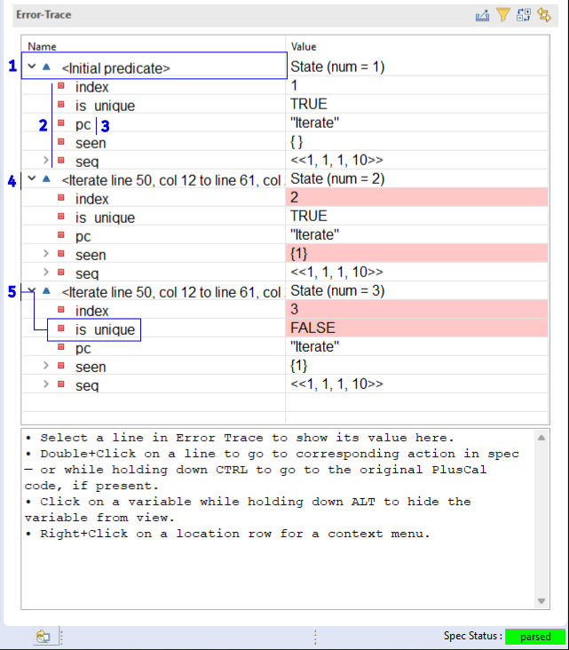

.. _chapter_invariants:

++++++++++++++++++++++++
Writing an Invariant
++++++++++++++++++++++++

.. index:: Invariant
.. _invariant:

Invariants
=============

In the last chapter, we wrote a simple specification for finding duplicates in a sequence. How do we know it's working, though? Here's another spec for finding duplicates that also runs without error:

::

  (*--algorithm find_duplicates
  variables
    seq \in S \X S \X S \X S;
    is_unique = TRUE;
  begin
    is_unique := FALSE;
  end algorithm; *)

This just says that every single sequence has duplicates! So, like in programming, we want to write some kind of automated test to verify this is correct.

In TLA+, the basic test we have is the *invariant*. An invariant is something that must be true on every single step of the program, regardless of the initial values, regardless of where we are. 

The most common invariant we use in programming: static types! When I have a variable of type ``boolean``, I'm saying that all points in the program, the value of that variable is always true or false, never a string or 17. We can write that as a TLA+ operator:

::

  TypeInvariant ==
    /\ is_unique \in BOOLEAN

.. index:: define
.. _define:

This operator needs to know about the ``is_unique`` variable, so we have to put it after the definition in PlusCal. There's a special block, the ``define`` block, we can put between variable definition and the algorithm proper. A define block contains pure TLA+ operators, and the operators may reference the values of PlusCal variables.

.. spec:: duplicates/inv_1/duplicates.tla
  :diff: duplicates/3/duplicates.tla
  :ss: duplicates_many_inputs

To check this, we add it as an :doc:`invariant <setup>`. TLC will check it at every possible state. All of the invariants passing looks the same as us not having any invariants— TLC will only do something interesting if the invariant fails. Here's what happens if we instead change the invariant to ``is_unique = TRUE``:

.. figure:: img/invariants_fail.png

This shows a series of steps, starting from the initial state. The top box shows which invariant was violated (useful if we have several), and the bottom box is the sequences of steps that lead to the invariant being violated. Let's look at the first two states in more detail:

#. This box shows the action that happened in that step. For the first one, no action happened, so it instead says ``<Initial Predicate>``.
#. These are the values of each variable after the action happens. For ``<Initial Predicate>``, these are the starting values of the error trace. Notice how ``seq`` is now a *fixed* value, one of the values in the set we said it could be.
#. ``pc`` is an extra variable the translator makes to track what label we're on. We'll talk about it `in a little bit <pc>`.
#. An ``Iterate`` action happens. This changes the values of ``index`` and ``seen``. Values changed in a step are shown in red.
#. When an invariant fails, the last step will be the one it failed on. Here we can see that after we check the second element, ``is_unique`` is false, breaking the invariant.

.. warning:: If an `assert <assert>` fails instead of an invariant, the error trace will end with the step *before* the assertion failed.

(There's a little more we can do with the error trace, see :doc:`here </topics/toolbox>`.)

So back to the nature of the invariant. We say ``is_unique`` is the boolean type by writing that it's an element of the set of all booleans. "Types" in TLA+ are just arbitrary sets of values. We could say that ``i`` is an integer, but we can be even more exact than that. We know that the it represents an index of ``seq``, or one past the sequence length. Its "type" is the set ``1..Len(seq)+1``. Similarly, we know ``seen`` can't have any values not in ``S``. Expanding our type invariant:

::

  TypeInvariant ==
    /\ is_unique \in BOOLEAN
    /\ seen \subseteq S
    /\ index \in 1..Len(seq)+1

I think that's enough of an introduction to invariants. Now let's write one that proves our algorithm correct.

.. index:: duplicates

Testing Duplicates
-------------------

When the algorithm finishes, ``is_unique`` is either true or false. If it's true, then every index of the value is unique. If it's false, then there must be duplicates. So we're looking at something like

::

  IsCorrect == IF is_unique THEN IsUnique(seq) ELSE ~IsUnique(seq)

We can simplify this by just using ``=``.

::

  IsCorrect == is_unique = IsUnique(seq)

Now the next two steps:

1. Actually implement ``IsUnique(s)``.
2. Currently, ``is_unique`` starts out true and flips to false if we find a duplicate. If the sequence *isn't* unique, then the invariant would fail as soon as we start— ``is_unique`` is true but ``IsUnique(seq)`` will be false. So we only want to check the "invariant" after the algorithm finishes running.

Writing ``IsUnique(s)`` *properly* requires learning some things. Writing it *improperly* is possible though, so let's start with that, then cover (2), the double back to doing ``IsUnique`` properly.

Here's the improper solution for ``IsUnique``:

::

  IsUnique(s) == Cardinality(seen) = Len(s) 

If the sequence has duplicates, then we won't run the ``\union`` line every single time, so it will have a different cardinality. In the next section, we'll see why this is "improper" and implement it properly, but for now this opens up our ability to discuss (2).

.. note:: This works because sets are unique.

.. index:: pc
.. _pc:

pc
....

Time for a quick leaky abstraction. We talk about the labels as being the units of atomicity. That's a PlusCal abstraction to help developers. These are translated to the "actions" in TLA+. To track the label, the PlusCal translator adds an additional variable called ``pc``. The value of ``pc`` is a string matching the name of the current label we are about to evaluate.

You can see this in the error trace. When we start the algorithm, ``pc = "Iterate"``. After the algorithm completes, ``pc = "Done"``. So we can test our invariant at just the end with

::

  IsCorrect == IF pc = "Done" THEN is_unique = IsUnique(seq) ELSE TRUE

On every label *except* "Done", this evaluates to TRUE and the invariant passes. When it *is* "Done", then we check the condition we care about.

.. index:: => (implies)

``IF A THEN B ELSE TRUE`` conditionals come up a lot, cases where we only want to check B if A is true. We can write that as ``A => B``: "if A is true, then B is true, otherwise we don't care". Now we have

::

  IsCorrect == pc = "Done" => is_unique = IsUnique(seq)

I said ``=>`` was really important earlier. This is one of those ways: it lets us say invariants should only apply under certain conditions. 

.. warning::

  ``=>`` follows the same indentation rules as other boolean operators. This means that

  ::

    /\ A
    /\ B
     => C

  Is interpreted as ``A /\ (B => C)``, *not* ``(A /\ B) => C``. When it doubt, add in parenthesis.

We can now run this as our full invariant; the spec will still pass.

.. index::
  single: quantifier
  single: quantifier; \A
  single: quantifier; \E
  single: \A (forall)
  single: \E (exists)

.. _\A:
.. _\E:
.. _quantifier:

Quantifiers
===================

.. note:: If you've been working in your own spec, I recommend switching to `scratch <scratch>` for now, since we'll be testing a lot of simple operators. 

Here's our current version of ``IsUnique``.

::

  IsUnique(s) == Cardinality(seen) = Len(s) 

I said that this is the improper way. That's for three reasons. First of all, it's tying the definition of uniqueness to ``seen``, which is a variable. Whether a sequence is unique or not should be independent of our actual behavior. It is or it isn't. The ``IsUnique`` operator should rely on the values in ``s`` and nothing else.

Second, this isn't really the *definition* of uniqueness. We're just using a clever trick involving set cardinalities. It'd be better if our operator captured the meaning of uniqueness, not use a weird side-channel which is coincidentally identical to uniqueness. 

Finally, this doesn't give us anywhere to go. We could represent uniqueness this way, but what about, say, sortedness? 

For all these reasons, it's time to introduce :dfn:`quantifiers`. A quantifier is a statement about the elements in a set. There are two: ``\A``, or "forall", tests if a statement is true about *every* element in the set. ``\E``, or "exists", tests if it's true for *at least one* element. If I write

::

  \A x \in {1, 2, 3}: x < 2

That's equivalent to "every element in the set is less than 2", which is false. If I wrote ``\E x \in {1, 2, 3}: x < 3``, that would instead be true.

.. warning:: 

  ``\A x \in {}: ...`` is always true, and ``\E`` is always false. All zero elements satisfy the statement, while not one does! In fact, this is the only case where "forall" can be true when "exists" is not.

We can pull multiple elements from the same quantifier. Example: a *composite* number is divisible by a number besides one and itself. I can write ``IsComposite`` as

::

  IsComposite(num) ==
    \E m, n \in 2..num:
      m * n = num

Notice that m and n can be the same number: ``IsComposite(9) = TRUE`` when we pick ``m = n = 3``.

.. tip::

  You can also pull from several *different* sets in the same quantifier: ``\A x \in S, y \in T: P(x, y)``.

We can't use a quantifier on a sequence, since that's not a set. But we *can* use it on the sequence's indices.

::

  Contains(seq, elem) ==
    \E i \in 1..Len(seq):
      seq[i] = elem

That suggests we can write ``IsUnique`` as

::

  IsUnique(s) ==
  \* Warning, this is wrong!
  \* We'll see why in the next part.
    \A i, j \in 1..Len(s):
      s[i] # s[j]

.. index:: => (implies)

.. _using_=>:

The power of :math:`\Rightarrow`
---------------------------------

Let's add this new version of ``IsUnique`` to our duplicates spec:

.. spec:: duplicates/inv_3/duplicates.tla
  :diff: duplicates/inv_2/duplicates.tla
  :fails:

If you run this, you will see it *fail*. And it fails in the oddest way, by saying a unique sequence has duplicates. In my case I got ``seq = <<1, 2, 3, 4>>``, but the exact one TLC finds may differ on your computer.

Let's use `CHOOSE` to ask TLC *what* indices it picked. Back in `scratch <scratch>`:

::

  Test == LET
    seq == <<1, 2, 3, 4>>
    s == 1..4
  IN
    CHOOSE p \in s \X s: seq[p[1]] = seq[p[2]]

  >>> Test
  <<1, 1>>

**We never said the indices had to be different.** Obviously every index is going to be equal to itself!

.. 

  Here's one way to fix it:

  ::

    IsUnique(s) ==
      \A i \in 1..Len(s):
        \A j \in (1..Len(s)) \ {i}:
          s[i] # s[j]

The best way to fix it, conveniently enough, really showcases the power of ``=>``: **it lets us rule out unwanted combinations in quantifiers.** Let's say we write

::

  IsUnique(s) ==
    \A i, j \in 1..Len(s):
      i # j => s[i] # s[j]

Then we pass in ``<<"a", "b">>``. There are four possible combinations of values for i and j. Let's write out the full truth table for every combination:

.. list-table::
  :header-rows: 1

  * - i, j
    - s[i], s[j]
    - P == i # j
    - Q == s[i] # s[j]
    - P => Q
  * - 1, 1
    - a, a
    - F
    - F
    - **T**
  * - 1, 2
    - a, b
    - T
    - T
    - **T**
  * - 2, 1
    - b, a
    - T
    - T
    - **T**
  * - 2, 2
    - b, b
    - F
    - F
    - **T**

For every combination, ``P => Q`` is true. This means the ``\A`` is true, and ``IsUnique(<<a, b>>)``, as expected.

Now let's do the same for ``<<a, a>>``:

.. list-table::
  :header-rows: 1

  * - i, j
    - s[i], s[j]
    - P == i # j
    - Q == s[i] # s[j]
    - P => Q
  * - 1, 1
    - a, a
    - F
    - F
    - **T**
  * - 1, 2
    - a, a
    - T
    - F
    - **F**
  * - 2, 1
    - a, a
    - T
    - F
    - **F**
  * - 2, 2
    - a, a
    - F
    - F
    - **T**

Since ``1, 2`` gives us ``T => F``, there's a case where the quantifier fails, and ``~IsUnique(<<a, a>>)``, as we want it to be. ``=>`` is an *incredibly* powerful tool for writing invariants. 

So we just make that change, and:

.. spec:: duplicates/inv_4/duplicates.tla
  :diff: duplicates/inv_3/duplicates.tla
  :ss: duplicates_many_inputs

This now passes! And with that, we've made a complete version of our specification: we have an algorithm, an invariant that determines its correctness, and a model that checks one against the other.

This is a common idiom for modeling simple CS algorithms. We can use the same pattern to model binary search, or topological sorting, or a SAT solver. This can be useful when trying to optimize an algorithm, since you can test that your optimizations don't make the implementation incorrect. 

.. warning:: Do not use ``=>`` with ``\E``! Imagine I wanted to an operator that checks if a sequence has duplicates, and wrote

  ::

    HasDuplicates(seq) ==
      \E i, j \in 1..Len(seq):
        i # j => seq[i] = seq[j]

  If I picked ``i = j = 1``, then the left-hand side would be false, meaning the expression is true, meaning the whole quantifier is true. *This holds regardless of the right-hand side!* Instead I should write

  ::

    HasDuplicates(seq) ==
      \E i, j \in 1..Len(seq):
        i # j /\ seq[i] = seq[j]

.. todo:: exercise for sortedness now

Summary
========

* An Invariant is something that must be true of every state in our specification.

  * A common invariant is the *Type Invariant*, which checks that all of your variable values belong to strict sets.

* When our spec violates an invariant, TLC produces a step by step error trace to show us how to reproduce the violation.
* Quantifiers test a predicate over a set. ``\A`` checks if something is true for every element, and ``\E`` checks if it's true for at least one element.
* Implication can be used to put "preconditions" on invariants, like "only check this when we've reached the end".
