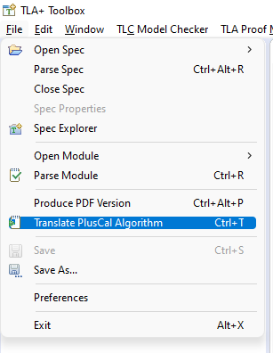

.. _chapter_pluscal:

++++++++++++++++++++++++
Writing Specifications
++++++++++++++++++++++++

Overview
===========

In the :doc:`last chapter <operators>`, we introduced operators, sets, and values, and did some simple computation with them. Now that we have that groundwork done, it's time to actually talk about specifications.

.. index:: pluscal

TLA+ is the *Temporal Logic of Actions*, where the "actions" are descriptions of state changes in the system. It's a powerful way of expressing mutation, but it is also very general, accepting a large degree of complexity to be able to express more powerful systems. Many engineers struggle to start learning it. So in 2009, Leslie Lamport created a DSL called PlusCal: a more programming-like syntax that compiles to TLA+ actions.

PlusCal isn't as powerful as "raw" TLA+, and there are some types of specifications you cannot write in it. But for many other kinds of specifications, it is *simpler* than doing everything in TLA+, and it is easier to learn. In my experience as an educator, I've found that most programmers have an easier time learning PlusCal and then raw TLA+ than they do if they start with raw TLA+. So the rest of the beginner part of this text will use PlusCal.

.. note:: If you're more mathematically inclined, or already know PlusCal and want to go further, you can skip to the section on :doc:`learning TLA+ <tla>`.

PlusCal
============

Let's start with a very simple spec:

.. spec:: pluscal.tla
 

Inside the comment block (``(* *)``) is our PlusCal algorithm. We need to do this because this is a valid TLA+ file; the pluscal algorithm will be compiled to TLA+ below. The algorithm must start with ``--algorithm $name``, otherwise it will be treated like a regular comment. Unlike the module name, the algorithm ``$name`` doesn't need to correspond to anything, and can be your root password for all anyone cares.

Next, we have a variables block. Any TLA+ value can be a variable. We open the body of the algorithm with ``begin`` and close it with ``end algorithm``. Inside that we have two :dfn:`labels`, ``A`` and ``B``, which we will discuss more in the next section. Inside the labels we have update statements, which use ``:=``. ``:=`` is **only** used when we have an existing variable and want to update its value. Otherwise, we use ``=``.

We discussed how to translate the pluscal in :doc:`setup`, but as a refresher, we can do this in the menu bar:

Alternatively, we can use :kbd:`cmd-T` on Mac or :kbd:`ctrl-T` on Windows and Linux. This puts a translation below the comment block:

::

  \* BEGIN TRANSLATION
  \* \* A bunch of TLA+ code
  \* END TRANSLATION

That's what's actually run when we model check this spec.

.. tip:: If you right-click in the spec, there's an option at the bottom of the context menu to "Translate PlusCal Automatically". This helps if you keep forgetting to translate, though it raises an error if you're writing a :doc:`pure TLA+ spec <tla>`.

.. index:: Labels
  :name: label

.. _labels:

Labels
------------

We're learning TLA+ to work on complex systems, so let's frame the motivation and existence of labels in that context. What are we building up to?

Complex systems have lots of *concurrency*, and many things are going on at once. Events aren't instantaneous, and may take some time to complete. But they can happen on different timescales. Compare these two steps:

1. Summing a list of 100 numbers.
2. Making an HTTP request and receiving the response.

The first line of code takes tens of nanoseconds to run, and the second tens of milliseconds. That's a time difference of six orders of magnitude. It might be possible for the summation to happen in between the request and response, but it's virtually impossible for the HTTP request to happen in between starting and finishing the summation. In our system, the first event would be "instantaneous", while the second would not.

Which brings us to labels. Labels represent everything that can happen in a single step of the system. If I write

::

  Label1:
    x := Sum(seq);

I am saying that the summation happens in a single step, and no time passes between the start and end of the summation. By contrast, if I write

::

  SendRequest:
    \* blah blah blah
  GetResponse:
    \* blah blah blah

Then *time passes* between ``SendRequest`` and ``GetResponse``.

.. note:: The labels represent the titular "actions" in the *Temporal Logic of Actions*.

If I wanted to, I could *choose* to make the summation nonatomic. Here's how I'd do it in PlusCal:

::

  Sum:
    while i <= Len(seq) do
      x := x + seq[i];
      i := i + 1;
    end while;

.. todo:: {GV} Diagram of the different times

We'll talk about the nuances of `while` later, but the basic idea is that now *each iteration* of the summation is nonatomic. We could add two numbers, start an http request, add two more, receive the response, and add the rest. Or we could add them all before both steps of the http, or all after. Concurrency is weird.

The point is this: the labels let us specify just how concurrent our system is. If we want to express that something is atomic, we can do that. If we want it to be interruptable, we can do that too. This is what gives us the flexibility to model systems in a way that actually finds relevant issues.

Label Rules
--------------

We're modeling time here, so there are restrictions on where we can place the labels. We'll recap all of the label rules `at the end <label_rules_summary>`.

First, **all statements must belong to a label.** This means, among other things, that you must always start the algorithm with a label.

Second, **any variable can only be updated once per label.** Remember, each label only represents one single instant of time. If the variable is updated twice, that means it's gone through two separate values in a single instant of time, meaning... it's not an instant of time anymore.

This poses a problem when updating sequences. This is invalid::

  Label:
    seq[1] := seq[1] + 1;
    seq[2] := seq[2] - 1;

.. index:: ||
.. _||:

Because we're updating the ``seq`` variable twice in one label. To get around this, PlusCal has the "simultaneous assignment" operator ``||``::

  Label:

    seq[1] := seq[1] + 1 ||
    seq[2] := seq[2] - 1;

The rest of the label rules relate to *specific* constructs in PlusCal, so let's go over those constructs now.

PlusCal expressions
-------------------

In addition to updates, there are three other statement-level constructs:

.. index:: skip, assert, goto
.. _goto:
.. _assert:

* ``skip``: a noop.
* ``assert expr``: TLC immediately fails the model check if ``expr`` is false. (This breaks the "everything in the label happens at once", as TLC will stop *as soon* as it finds a failing ``assert``.) To use ``assert`` you need to extend ``TLC``.

  .. warning::

    The error trace will *not* show the step that triggered the failing assert! For that reason, prefer invariants to asserts.

* ``goto L``: jumps to label ``L``. **A label must immediately follow any goto statement**.

.. todo:: {CONTENT} Also mention print

Everything else in PlusCal is a block-level construct.

.. index:: if (pluscal)

.. _if_pluscal:

if
....................

::

  if Expr then
    skip;
  elsif Expr2 then
    skip;
  else
    skip;
  end if;

You *can* put labels inside an if block. This is useful if your logic branches, and some of the branches represent more complicated behavior. You don't need to balance the labels in an if block— some conditionals can have labels and others do not. **However, if any branch has a label, you must follow the entire block with a label**. To see why, consider the following:

::

  A:
    if bool then
      B:
        skip;
    else
      skip;
    end if;
    x := 1;

If ``bool`` is true, then  ``x := 1`` would happen as part of label B. But if ``bool`` is false, then it would happen as part of label A. Since statements must *unambiguously* belong to a single label, this is invalid PlusCal, and we need to add an extra label ``C``.

.. warning:: A common misunderstanding I see in beginners is thinking the B label is *nested in* the A label, like we're in both at the same time. This isn't how it works: we stop being in the A label as soon as we enter the B label. A better mental model is that since ``B:`` is inside a condition from ``A:``, the B label is only *reachable* from A.

Not all blocks have to have the *same* number of labels! Conditionals trigger different behavior, which can take different amounts of time.

.. index:: macro
.. _macro:

macro
......

Macros are simple rewrite rules, designed to help clean up repetitive bits of logic. They must be placed above the ``begin`` block of the algorithm. **Macros may not contain labels.**

::

  macro inc(var) begin
    if var < 10 then
      var := var + 1;
    end if;
  end macro;

Macros count as *textual* substitutions. If we passed in ``some_inc(x)`` then it would increment the ``x`` variable.

.. index:: ! with
  :name: with

with
.....

``with`` statements let you create temporary assignments in the middle of a label.

::

  with tmp_x = x, tmp_y = y do
    y := tmp_x;
    x := tmp_y;
  end with;

Inside the ``with`` definition, we do the temporary assignments with ``=``, not ``:=``. Remember the rule: ``:=`` is only used for updating an existing variable.

As with macros, ``with`` **statements cannot have labels.**

.. index:: while

.. _while:

while
......

``while`` is the only form of loop we have. **A while loop must always be preceded with a label.**

::

  Sum:
    while i <= Len(seq) do
      x := x + seq[i];
      Inc:
        i := i + 1;
    end while;

**While is nonatomic**. After each iteration of the while loop, we're back at the ``Sum`` label. Other processes can run before the next iteration. This doesn't change things for single process algorithms, but it will matter a lot when we start adding in concurrency.

.. index:: ! duplicates
.. _duplicates:

A Duplication Checker
======================

Now that we know the basics of PlusCal, let's apply it to a small problem. I like to start with simple array algorithms, because we already have the tools to specify them. First we write an operator that expresses the high-level goal of the algorithm, then we write the algorithm, then we verify the algorithm matches the operator.

For example, if we were writing an algorithm to check if ``seq`` has any duplicate elements, the operator might be ``IsUnique(seq)``, and then the algorithm could work like this:

1. Create an empty set ``seen``, then step through the elements of ``seq``.
2. Every time we see a number, we check if it's already in ``seen``.

    * If it is, we say the list is not unique.
    * Otherwise, we add the element to ``seen`` and continue.

3. If we reach the end and haven't seen any duplicate elements, we say the list is unique.
4. Our decision should match the operator ``IsUnique(seq)``.

In this chapter we'll focus on just writing out the spec, parts (2) and (3). In :doc:`the next chapter <invariants>` we'll do steps (1) and (4), actually verifying the algorithm.

I called this spec ``duplicates``, but the name isn't too important for this.

.. no ss because I haven't introduced it yet
.. spec:: duplicates/1/duplicates.tla

(I *think* this is self-explanatory, but I've been doing this so long I have no idea what is or isn't explanatory anymore. If enough people say otherwise I'll put a fuller description here.)

If you `run it <running_models>`, you will see a page like this:

.. figure:: img/pluscal_run.png
  :scale: 30%

  (Click to zoom in)

I know this completed successfully because otherwise a big error bar would have appeared on the right-hand side. Everything on this page is statistics to help you understand the run better:

1. Since complicated models can take a long time to check, the "state space progress" tab updates roughly once a minute.

.. index:: diameter

2. Diameter is the length of the longest behavior. If TLC found a thousand behaviors with length 2 and one with length 20, the diameter will be reported as 20.

3. States found is how many system states the model checker has explored. This includes duplicate states the checker found in different paths.

4. The number of *unique* states found.

5. How many states TLC knows *for certain* it'll have to check. Some of these states will add more states to check, and so on and so forth.

6. TLC stores explored states as hashes, this is the chance that there's a hash collision. In practice this never goes above one in a million billion and can be ignored.

7. How often each label was run and how many states that lead to. If one label has 0 states then there's probably a bug in your spec.

.. digraph:: duplicates_1
  :caption: Four iterate loops, plus Initial and Done states, makes 6 distinct states.

  edge[arrowhead=vee];

  I1 [label="i=1\nseq[i]=1"];
  I2 [label="i=2\nseq[i]=2"];
  I3 [label="i=3\nseq[i]=3"];
  I4 [label="i=4\nseq[i]=4"];

  I1 -> I2 -> I3 -> I4;

To make sure that you're following properly, you can check that that you got the same number of states and distinct states I did. In my case, I got :ss:`duplicates_fixed_input`; you should see that too. If you get a different number, you may have made a mistake in transcribing the spec. The states and distinct states make a partial "fingerprint" of the model. Going forward, whenever I show a spec, I'll list the states and distinct states of the model check under the code listing.

.. note:: You'll get a different number than me if the spec *fails*, because TLC will terminate execution early. In that case, I will note that the modelcheck should fail when showing the code listing.

.. _multiple_starting_states:

.. index:: \in; variable definition

Testing More Inputs
-------------------------

We now have a basic implementation of our duplication checker. When we run it, though, we want to make sure it's working properly for both unique and non-unique sequences. Right now we've only hardcoded a single sequence, so we can only check one of the two cases.

To check both, we can use multiple starting states. TLA+ doesn't just let us assign values to variables, it also lets us say a variable starts out as *some* element in a set. It looks like this:

.. spec:: duplicates/2/duplicates.tla
  :diff: duplicates/1/duplicates.tla

The model checker will now check *both* ``<<1, 2, 3, 2>>`` and ``<1, 2, 3, 4>>`` as the value of ``seq``. More specifically, does two complete runs, one for each possible value. If either complete run, or :dfn:`behavior`, would lead to an error, TLC will let us know.

.. figure:: graphs/duplicates_2.gv.png

  There are two possible starting states, each with its own behavior.

Adding multiple starting states increases the complexity of our model. If, in a spec, TLC will normally have to check 10 states, adding 100 initial states could increase the state space to a maximum of 1,000. In practice, it will often be lower, because sometimes initial states will converge:

::

  variables x \in 1..1000;
  begin
    A:
      x := 0;
    B:
      x := x+1;
  end algorithm;

We might think, with 1000 initial states and 2 labels, there will be 3,000 total states. In practice, the first label "collapses" the state space. So the number of *distinct* states will be far smaller.

10,000 starting states
----------------------

So now we're testing two inputs. That's twice as good as one input. Even better than that would be testing 10,000 inputs. Remember how in the last chapter we talked about generating `sets of values <sets_of_values>`? This is just one of the many places it's really useful.

.. spec:: duplicates/3/duplicates.tla
  :diff: duplicates/1/duplicates.tla
  :ss: duplicates_many_inputs

We're now significantly more likely to cover all interesting edge cases. This isn't *guaranteed*: maybe there's a bug that *only* triggers if we have ``-187`` in there somewhere. TLA+ can only augment your engineering judgement, not replace it. But my judgement is telling me that it's unlikely for ``-187`` to be the edge case, so I'm confident calling this good coverage.

.. note:: Okay, there's one big gap: while we're trying a lot of different elements, we're only looking at one fixed *length*. Maybe there's an issue with 1 or 0-length sequences. We'll be able to fix this once we learn about `function sets <function_set>`.

Now that we have broad state-space coverage, it's time to write some properties. In :doc:`the next chapter <invariants>` we'll specify that our checker always gets the correct result.

.. todo:: {UPDATE} This is the right place to talk about unbound models.

Summary
=========

- Specifications have variables. These can either be a fixed value (using ``=``) or an element in a set (using ``\in``). Any TLC value can be a variable.

  - If an element of a set, then TLC will test the model on *every possible starting state*.
- PlusCal is a language that makes writing specifications easier.

  - In the PlusCal algorithm body, variables are updated with ``:=``. ``=`` is comparison.

- PlusCal specs are broken up into *labels*, units of computations that happen atomically. Everything in the label happens *at once*. Labels have restrictions on where they can be placed.
- Macros are the primary unit of spec deduplication.
- PlusCal has several block constructs, including ``with``, ``if``, and ``while``.

  - ``with`` creates temporary identifiers in a block.
  - ``while`` statements are nonatomic: every loop happens in a separate step.

.. _label_rules_summary:

Summary of Label Rules
----------------------

- All algorithms must begin with a label.
- While statements must begin with a label.
- Each variable can only be updated once in a label. (You can assign to multiple parts of a sequence with `|| <||>`.)
- Macros and ``with`` statements cannot contain labels.
- A :ref:`goto <goto>` must be followed by a new label.
- If a branch in a block contains a label inside it, the end of the block must be followed with a label.
