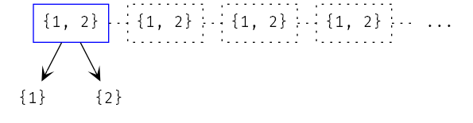
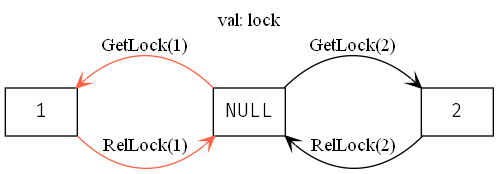

.. _chapter_temporal_logic:

##########################
Temporal Properties
##########################

Intro
=======

Invariants aren't really part of TLA+. There's no concept of an "invariant" that's treated as special by TLA+. The model checker, TLC, gives us that, but more that's due to pragmatics and efficiency than "invariants" being something deeply important. Rather, TLA+ provides a *general principled* way to write all kinds of different properties, where invariants are just one of many things we can check. To write these, we use a set of :dfn:`temporal operators` to describe logical statements across time. We call the broad class of all properties :dfn:`temporal properties`.

.. index::
  single: safety
  single: liveness

There are two kinds of temporal properties: "safety" properties say our system doesn't do bad things. "liveness" properties say our system always does a good thing. "We do not violate any database constraints" is safety, "All transactions either complete or roll back" is a liveness property. All invariants are safety properties, but not all safety properties are invariants. For example:

.. spec:: liveness/1/orchestrator.tla
  :ss: orchestrator

"There is at least one server that's always online" could mean one of two things:

1. At any given point in time, there is at least one server online.
2. In every behavior, there is a particular server, and *that* server is online at all points in time.

\(1) is a standard invariant. (2) is a safety property, but **not** an invariant. There is no individual state, by itself, that would violate it. Say I give you the state ``online = {1}``. Is that a violation? *Only* if, in the behavior, there's another state where ``1 \notin online``. So we can't just look at a single state to know if we've broken (2) or not.

TLC can check (2) as a temporal property, though. 

.. index:: 
  single: [] (always)
  see: always; []

.. _always:

[] (always/"box")
==================

``[]P`` means that ``P`` is true in every state. When on the outside of a predicate, this is equivalent to an invariant, and in fact is how TLC supports them: making ``P`` an invariant is the same thing as making ``[]P`` a property. 

.. warning:: Making ``P`` a property (without the box) will just check that P is true in the first state.

Things get more interesting when ``[]`` is part of a larger expression. Writing ``[]P \/ []Q`` means every behavior has either P or Q as an invariant, but doesn't need to have both. Or we could write ``[]P => []Q``, to say that P is a *stronger* invariant than Q. We can also put a ``[]`` inside a quantifier. To properly model (2), we could write::

  Safety == \E s \in Servers: 

At the beginning of the behavior, we pick one online server. That server is then *always* online. This isn't true: if we check with ``PROPERTY Safety``, then we get an error trace.

.. spec:: liveness/2/orchestrator.tla
  :diff: liveness/1/orchestrator.tla
  :fails:

::

  State 1: online = {"s1", "s2"}

  State 2: online = {"s2"}

  State 3: online = {"s1", "s2"}

  State 4: online = {"s1"}

.. figure:: graphs/liveness.gv.png

  The behavior sequence 1-2-3 breaks violates our safety property, even though no state is individually a "bad state".

In summary, adding ``[]`` to the language lets us represent all invariants, and a host of other properties too.

.. index:: fairness; in PlusCal
.. _fairness:

Anything can crash 
===================

``[]`` is just a logical operator, like any other, meaning we can combine it with other logical operators. ``[]~P`` means that P is always not true. ``~[]P`` means that P isn't *always* true. There are two things that could mean:

1. In every behavior, there is at least one state where P is false
2. There is at least one behavior which has at least one state where P is false.

Version (1) is more often useful in specs, so that's what ``~[]P`` formally means. [#ctl]_ If we write

.. spec:: liveness/3/orchestrator.tla
  :diff: liveness/2/orchestrator.tla
  :fails:

This is a *liveness* property, not a *safety* property. In order to satisfy ``Liveness``, the behavior has to *reach* a state where the server is offline.

We'd expect that to pass. The orchestrator can do one of two things: remove an existing server from ``online`` or add one that's not in it. So if all the servers start online, then eventually we'll remove one, right?

.. index:: stuttering
  :name: stuttering

Not so fast! There's a *third* thing the orchestrator can do: it can crash. In TLA+, any behavior is allowed to :dfn:`stutter`, or make a new state where nothing happens and all variables are unchanged. This includes stutter-steps, meaning any behavior can stutter infinitely, aka crash. And that's exactly what we see if we run the spec with ``PROPERTY <- Liveness``:

.. figure:: img/stuttering.png

.. note:: Why haven't we see this before? Because up until now we've only had invariants, which are only violated by "bad states": particular configurations of variables that break the invariants. Stutter steps don't change the values of anything, so a stutter step can never break an invariant. Here's the first time it can break things by *preventing* us from reaching a good state.

TLA+ allows infinite stutter steps because it is fundamentally a worst-case scenario language. IN reality, systems always crash. If we do not *explicitly say* a system can't crash, TLA+ will assume the system can crash at the worst possible time.

  We can always keep stuttering at the ``{1, 2}`` state. Even though it *could* transition to either good state, it doesn't *have* to.

So we need a way to say "don't assume this system can crash". We do this by saying it's a :dfn:`fair process`.

.. spec:: liveness/4/orchestrator.tla
  :diff: liveness/3/orchestrator.tla
  :ss: orchestrator

This makes the process :dfn:`weakly fair`: it cannot "stop forever". Once we add this change, we see ``Liveness`` holds. There's also **strong** fairness. But this easier to explain (and more useful) in pure TLA+, as opposed to PlusCal. I'll leave the PlusCal material in an advanced topic here.

.. rubric:: Strong Fairness

Weak fairness says that if a process can *always* make progress, it will eventually make progress. Strong fairness is that if a process can *always intermittently* make progress, it will eventually make progress. To see the difference, consider this model of several threads sharing a lock (``<>`` is defined `below <eventually>`):

.. spec:: threads/strong_fairness_1/threads.tla
  :fails:

When in ``GetLock``, each thread can only get the lock if ``lock = NULL``. So it's only *intermittently* able to progress. Since every thread with the lock is guaranteed to release it, it's *always intermittently* able to progress. In weak fairness, if we have five threads, we can't guarantee that all five threads will eventually get the lock; one could get starved out.

If thread 1 keeps stealing the lock, then thread 2 never has a chance to get it, even if it's weakly fair.

We can make the processes strongly fair by writing ``fair+``. Then every thread will eventually get the lock. We can also make individual actions strongly fair by writing ``AwaitLock:+``.

.. spec:: threads/strong_fairness_2/threads.tla
  :diff: threads/strong_fairness_1/threads.tla
  :ss: strong_fairness_threads
  :name: strong_fairness_spec

We'll double back to strong fairness when we talk about writing `Pure TLA+ <chapter_tla>` specs, where we can do a little more with it.

.. tip::
  
  Not every process in a spec needs to be fair. Consider a spec where one process represents the worker and one represents a user. The user actions aren't *guaranteed* to happen: the user can always log off.

.. index::
  single: <> (eventually)
  see: eventually; <>

.. _eventually:

<> (eventually / "diamond")
===========================

While ``~[]P`` has some interesting properties, we rarely write it. It's not often we need to check that something "is sometimes" not true in our system. What *is* useful is writing ``~[]~P``: "Sometimes 'not P' is false", or "Sometimes P is true". This means that P isn't an invariant in all states, but must hold in *at least one* state. 

Because "Not always not P" is a mouthful, we have a separate operator that means the same thing: ``<>P``, or "Eventually P". We've already been crudely simulating "eventually" properties before, in duplicates and `threads <threads>`. Here's the correctness condition for threads:

::

  AllDone == 
    \A t \in Threads: pc[t] = "Done"

  Correct ==
      AllDone => counter = NumThreads

The ``AllDone =>`` is just a precondition that ``counter = NumThreads`` is true at the end of the algorithm execution. Using ``<>`` we can rewrite it as a temporal property:

.. spec:: threads/liveness_1/threads.tla
  :diff: threads/3/threads.tla
  :fails:

(Remember this is checked under "Temporal Properties", not "Invariants"!)

When we run this with ``PROP Liveness, NULL <- [mv]`` the spec fails due to stuttering. There's no guarantee the threads will finish running, because they're unfair. This *wasn't* a problem with ``Correct`` before because that only says that *if* we reach the end, *then* the answer is correct. It still passes if we never reach the end!

Making the threads fair makes this pass:

.. spec:: threads/liveness_2/threads.tla
  :diff: threads/liveness_1/threads.tla
  :ss: threads_liveness

.. index:: <>[]

In one way, ``Liveness`` is more accurate than ``Correct``. In another way, though, it's *less* accurate. Here's a bug that wouldn't pass ``Correct``:

.. spec:: threads/liveness_3/threads.tla
  :diff: threads/liveness_2/threads.tla

When we're done, ``counter = 3``... but ``Liveness`` still passes! This is because ``<>(counter = 2)`` is true if ``counter = 2`` in *at least one state* of the behavior. It doesn't matter if we then change *away* from that, because it's been true at least once.

.. digraph:: Error
  :name: problem_graph
  :caption: Since it passes through a state where ``counter = 2``, this passes ``<>counter = 2``.

  label="val: counter"
  1 2 3;
  2[color="darkgreen"];
  1 -> 2 -> 3 -> Done;

  
.. rubric:: <>[]

Fortunately, our temporal operators are extremely flexible, and we can compose them together. If ``[]P`` means "P is always true", and ``<>P`` is "P is eventually true", then ``<>[]P`` is "eventually P is always true". P can start out false, but after some point in every behavior, it will forevermore be true.

.. spec:: threads/liveness_4/threads.tla
  :diff: threads/liveness_3/threads.tla
  :fails:

This now fails, as ``counter`` doesn't stay as 2.

.. digraph:: Error
  :caption: Since counter doesn't *converge on 2*, this fails ``<>[]counter = 2``.

  label="val: counter"
  1 2 3;
  2[color="darkgreen"];
  Done[color=tomato]
  1 -> 2 -> 3 -> Done;

.. tip::

  You can also write ``[]<>P``: "P is always eventually true". In the threads spec, this has the same outcome, but there are cases where it's broader than ``<>[]P``. For example, in an hour clock, ``[]<>(time = midnight)`` is true, but ``<>`` is false.

.. index::
  single: ~>
  see: leads-to; ~>

.. _leads_to:
.. _~>:

~> (leads-to)
=============

The last operator is ``~>``. Recall that ``P => Q`` preconditions Q on P: if P is true, then Q is also true. ``P ~> Q`` is the temporal analog: if P is true, then Q is *eventually* true (now or in a future state).

.. todo:: better example?

  ::

    Liveness ==
      \A e \in Employees:
        r \in Reimburisment ~> Filed_reimbursement

Say we have a set of tasks described by ``TaskType``, an ``inbound`` pool of type ``SUBSET TaskType``, and a set of workers with their own task sets. A property of this system might be that every inbound task is eventually processed by a worker. You can represent this with ``~>``:

  ::

    Liveness ==
      \A t \in TaskType:
        t \in inbound
          ~> \E w \in Workers:
            t \in worker_pool[w]

.. note:: ``P ~> Q`` is triggered *every* time P is true. Even if the formula was satisfied before, if ``P`` becomes true again, then ``Q`` has to become true again too.

.. todo:: {Content}

When to use Liveness
==========================

You probably won't need to ever write a property of form ``\E x: )``. 

Liveness properties are less common than invariants. Invariants check faster and give you finer-grained information, and they're a lot easier to write! Most systems will have lots of invariants but only a couple of liveness properties. However, the liveness properties are still critical to the spec, as they define what it is we actually want to *do*.

.. rubric:: Considerations

* It takes TLC significantly longer to test liveness properties than safety ones. Usually you'll have one model that with large constants for testing safety properties, and a model with smaller constants for testing liveness properties.
* You cannot use `symmetry sets <model_set>` with liveness properties.
* For implementation reasons, TLC can't currently tell you *which* property is broken. It can only tell you "Temporal Properties are Violated".
* Again, due to implementation details, error violations for liveness properties won't be as-short-as-possible. You might get a shorter (and more understandable) error trace if you rerun the model with smaller constants.

Summary
=========

- In addition to checking properties of states, TLA+ can check properties of entire *behaviors*.
- Safety properties are "bad things don't happen", liveness properties are "good things do happen". All invariants are safety properties, and all liveness properties are temporal properties.
- All TLA+ specs are "stutter-invariant", meaning they can crash at any time. A "weakly fair" process is guaranteed to "not crash", though it can spinlock.
- ``[]P`` means that P is true for every state of every behavior. ``<>P`` means that P is true for at least one state of every behavior. ``P ~> Q`` means that if P is true in a state, then Q will be true in a (present or) future state.

.. [#ctl] This isn't "settled fact": there are `other systems <https://en.wikipedia.org/wiki/Computation_tree_logic>`__ where ``~[]P`` only needs P to be false in one state of one behavior. These systems tend to be worse at modeling some things and better at modeling others.
