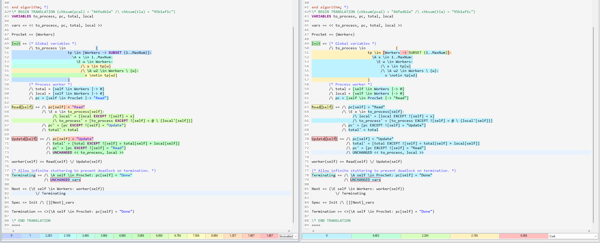

.. _topic_optimization:

#########################
Optimizing Model Checking
#########################

You've written your model, and you run it. Three days later, it's still running. How do you make it faster?

Optimizing models is more an art than a science. It's a skill you have to develop over time, and every model is optimized differently. This is just a collection of basic heuristics that I find broadly useful. 

Before you begin
===================

Some things you should check before you start optimizating:

.. rubric:: 1. Make sure your model is :ref:`bounded <topic_unbound_models>`

Maybe the problem isn't "your spec is too big" but instead "your spec will never terminate". 

.. rubric:: 2. Check your runtime parameters

By default, the toolbox uses 25% of your computer RAM and one worker thread per CPU core. If you instead run TLA+ from the :ref:`command line <topic_cli>`, it will default to using 25% RAM and *exactly one* worker. So make sure you pass in a ``-workers`` flag!

.. rubric:: 3. Check your hardware

Model checking is both CPU- and memory-intensive. At times, it's even *single-core* intensive, as the liveness checking algorithm for TLC is single-threaded. Sometimes getting a bigger machine is the best thing you can do.

Overview
========

The Spec
---------

To discuss optimizations, we'll use the following:

.. spec:: topics/optimization/1/optimization.tla
   :ss: optimization_7_3_nosym

Run with ``MaxNum = 7``, ``Workers = {w1, w2, w3}``, and no deadlock checking. You should get 28,351,303 (28M) states. I'll be showing optimizations one-at-a-time as changes to this base model, and undo them before showing the next optimization.

.. tip::

  The spec can take up to 28 seconds to run on my computer. To test optimizations out faster, I'll use a trick to iterate more quickly. :ref:`TLCGet <tlcget>` lets us query the current depth of the model checking with ``TLCGet("level")``. I'll add the :ref:`constraint <state_constraint>` ``TLCGet("level") < 12`` to my spec.

  .. spec:: topics/optimization/2/optimization.tla
    :diff: topics/optimization/1/optimization.tla
    :ss: optimization_7_3_nosym_level

  This reduces the state space by 97% percent, making it easier for me to try out different optimizations. When I'm done I'll remove the constraint and see how much my optimizations help with the whole spec.

The Basics
----------

Generally, model checking time depends on two things:

1. The time it takes to generate each state.
2. The number of states it needs to generate.

In my experience, (2) dominates and deserves the most attention. Sometimes I'll be able to optimize generation time by 5-10%. Quite often I'll work with a model and find an improvement that reduces the state space by a factor of 10.

Estimating the state space
--------------------------

Before we start optimizing, it's a good idea to get a handle on where the "complexity" is. Most of these estimates will be inaccurate, but they'll give us an idea on where to start.

First, let's start with the ``writer``. There are :math:`3^7 = 2187` possible ways to assign 7 numbers to one of three workers. Adding one more worker would octuple the number of possible assignments, while adding one more number would only triple it. So *right now*, the number of workers is having more impact on the state space than ``MaxNum``. On the other hand, if we had seven workers and ``MaxNum = 3``, incrementing ``MaxNum`` would do more than adding an eighth worker.

As a quick test, try making both constants smaller. Reducing ``MaxInt`` by 1 reduces the statespace to only 3.2M states, while removing a worker drops the state space to 1.3M.

Set Sizes
.........

As we'll see later, ``writer`` is essentially an inefficient means of picking a function from the :ref:`function set <function_set>` ``[1..MaxNum -> Worker]``. When estimating state spaces, it's useful to know some how big some collection types get. In the below table, ``|S| = Cardinality(S)``.

.. set_sizes

.. list-table:: Set Sizes
  :name: set_sizes
  :header-rows: 1

  - * Set
    * Num Elements
  - * S
    * :math:`|S|`
  - * SUBSET S
    * :math:`2^{|S|}`
  - * ``S \X T`` (tuple)
    * :math:`|S|*|T|`
  - * ``[s: S, t: T]`` (:ref:`struct set <struct_set>`)
    * :math:`|S|*|T|`
  - * ``[S -> T]``
    * :math:`|T|^{|S|}`
  - * ``[1..n -> S]`` (:ref:`sequence set <function_set>`)
    * :math:`|S|^n`

These stack; if you have something like ``[A \X B -> SUBSET C]`` in your spec that's probably the source of your woes.

Concurrency
...........

There are ``3^6`` ways to assign six numbers to three workers and ``3^7`` ways to assign seven, a factor of... 3 difference. So why does ``MaxNum=7`` increase the statespace *ninefold*?

Because concurrency is against us, too! Imagine we've assigned the first six numbers and none of the workers have run yet. There are *nine* possible things that can happen:

* 1-3: The writer assigns ``7`` to ``w1``, ``w2``, or ``w3``
* 4-5: ``w1`` calls read on *either* of its two numbers
* 6-9: either ``w2`` or ``w3`` calls read on its two numbers.

Then if ``w1`` runs, there are eight possible next steps from *that*: the writer and the other workers can do their original actions, or ``w1`` can do ``Update``. Concurrency gets messy very very quickly.

In any case, we can see that the concurrency in the system is contributing about as much as the constants are, so we'll need to reduce both to improve the state space.

Model changes
=============

Use smaller constants
---------------------

As we've already seen, using fewer workers and a lower ``MaxNum`` can each shrink the state space tenfold. This is usually the first recourse. Most bugs appear with small state spaces anyway, so there's not much benefit to using enormous constant inputs. If you *do* need to model check very large constants, use a separate model config with small constants for fast iterations, and only check the larger model when the small one is passing.

For this particular spec, reducing constants is enough to make the model checking tolerable. But that's not always true, so the other techniques are still important.

Use symmetry sets
-----------------

As a very rough rule of thumb, if you take an n-element set of model values and make it a :ref:`Symmetry sets <symmetry_set>`, you'll decrease the state space by a factor of about :math:`n!`. In this case, making ``Workers`` a symmetry set reduces the state space to 4.7M states, a reduction of about 6.

Note that if you're using the cli, you'll have to define the symmetry relaton in the model, like this:

.. spec:: topics/optimization/3/optimization.tla
  :diff: topics/optimization/2/optimization.tla
  :ss: optimization_7_3_sym

Then put ``SYMMETRY Symmetry`` in your config file.

Separate safety and liveness
----------------------------

This isn't an issue with this spec, but you should always have separate models for checking safety properties (invariants and :ref:`action properties <action_properties>`) and liveness (everything else). Liveness checking is a *lot* slower than safety and it prevents symmetry set optimizations. Use smaller constants for your liveness checking.

Reducing concurrency
====================

Remove "loader" processes
-------------------------

The writer is what I call a "loader" process: all it does is manually set up ``to_process``. While it can interleave with the workers, the interleaving doesn't change the spec behavior. So we can replace the entire worker by figuring out all the possible end values of ``to_process`` and making it *start* :ref:`as one of those values <multiple_starting_states>`. 

The writer assigns each number to exactly one worker, so by the end ``to_process`` will map each worker to disjoint :ref:`subsets <subset>` of numbers. We can decompose that into two logical statements:

1.  For each number, there's a worker it belongs to, and
2.  It doesn't belong to any other worker.

.. spec:: topics/optimization/fs/optimization.tla
  :diff: topics/optimization/3/optimization.tla
  :ss: optimization_fs

This change leads to a 3x reduction in states. That said, it also makes initializing states take a lot longer than it should. We'll cover why :ref:`later <construct_dont_filter>`.

Do more in each action
----------------------

Currently each worker takes two actions to process one number: one to pull a number from ``to_process`` and one to add it to ``total``. This creates a place where another worker (or ``writer``) can interrupt.

Here's a trick to estimate how much overhead this adds: let's assume each worker has exactly one number in its ``to_process``, so each of the three workers does exactly two steps in sequence. While each worker has to do the two steps in order, the workers are independent of each other. Then there will be 

  .. math:: \frac{\left(2+2+2\right)!}{2! \cdot 2!\cdot 2!} = 90

possible behaviors, and :math:`6 \cdot 90 = 540` new states.

If we fuse the two labels into one, like this:

.. spec:: topics/optimization/one_label/optimization.tla
  :diff: topics/optimization/3/optimization.tla
  :ss: optimization_one_label

Then we reduce the state space to just 2.4 million states!

Fusing actions isn't something you should do blindly. Remember, the point of writing a model in the first place is to find concurrency-based system flaws! You have to consciously think about the :dfn:`grain of atomicity` of your spec: how much you let be atomic and how much you let be interruptable. Choosing too coarse a grain might hide legitimate errors, while choosing too fine a grain might make model checking take too long.

Reduce Unintentional Nondeterminism
------------------------------------------

The ``Read``, the worker is allowed to pull *any* number in its pool for processing. This makes the model robust against ordering: it works no matter *which* order we process items. But often we don't care about *any* order, we care about a *specific* order! Maybe we process things in the order they were received, or we process the lowest items first, or something like that. So the spec is more nondeterministic than we actually need it to be.

In this case, the algorithm is commutative and it doesn't matter which order we use. So I'll pick a completely arbitrary order via ``CHOOSE``:

.. spec:: topics/optimization/fixed_with/optimization.tla
  :diff: topics/optimization/3/optimization.tla
  :ss: optimization_fixed_with

.. warning:: This is one of the rare cases where I'm comfortable with a ``CHOOSE x \in set: TRUE``. Otherwise it's :ref:`deterministic <choose>`, which a lot of people don't expect!

This reduces the state space to just 2.1 million states, our biggest reduction yet! This surprised me, but makes sense in retrospect. If the writer assigns every item to a single worker, it can pull the items out in :math:`7! = 5040` different orders.

Use Bags instead of Sequences
-----------------------------

What if the writer could send the same number twice? Then using a set for ``to_process`` would be a bug, since it'd remove the duplicate element. The easiest fix would be to replace it with a sequence::

  to_process = [w \in Workers |-> <<>>]

The problem with using a sequence is that it doesn't just add redundancy, it adds *ordering*. ``<<a, b, a>>`` is a different sequence than ``<<a, a, b>>``, leading to different states!

If you want redundancy *without* ordering, use a :ref:`bag <bag>` instead::

  to_process = [w \in Workers |-> EmptyBag]

Then the bag ``[a |-> 2, b |-> 1]`` is unique.

Use Views
---------

This is an advanced technique and should only be used with caution. To set it up, let's say we add an auxiliary variable to track the last process run:

.. spec:: topics/optimization/view_1/optimization.tla
  :diff: topics/optimization/3/optimization.tla
  :ss: optimization_view_1

This balloons the state space to 80M states! Behaviors that used to lead to the same state now lead to different states. But the difference is only in an auxiliary variable and shouldn't affect the behavior of our spec.

To determine if two states are distinct, TLC compares their values for ``<<i, pc, to_process, aux_last_run>>``. If we want, we can tell TLC instead compare them with ``<<i, pc, to_process>>`` and ignore ``aux_last_run`` entirely. This called setting a :ref:`view <view>`. First we add an operator corresponding to our view:

.. spec:: topics/optimization/view_2/optimization.tla
  :diff: topics/optimization/view_1/optimization.tla
  :ss: optimization_view_2

Then we tell TLC to use ``view`` as our view. In the Toolbox that's under ``TLC Options > Checking ode > View``. In the :ref:`cli <topic_cli>` add  ``VIEW view`` to the config.

Adding the new view reduces our state space to just one million states... *less* than the amount in our basic spec. I forgot that each writer has ``total`` and ``local`` variables, too, which needs to be part of our view. Since that's local to the process we can't reference it in a ``define`` block and need to put the whole thing below our translation. 

.. spec:: topics/optimization/view_3/optimization.tla
  :diff: topics/optimization/view_2/optimization.tla
  :ss: optimization_view_3

Views can nullify the state-space impact of adding an aux variable, but it's also really easy to remove valid states, too, so be very careful when you use them.

Reduce Spec Detail
------------------

Finally, notice everything we're *not* modeling. We're not modeling how workers are discovered. We're not modeling the connection protocol. We're not modeling any kind of transient errors, or any detail about the payload besides a single number. 

This is the most important heuristic about state space optimization: **the more detailed your model, the more states you will have**. I often see beginners model things like ``load \in [Server -> 0..100]``. A more experienced modeller would instead write something like ``load \in [Server -> 0..3]``. Or, if they could get away with it, ``overloaded \in [Server -> BOOLEAN]``.

Get in the habit of modeling only what matters to your system, and you'll have a better experience.

.. tip:: If you *do* need to model a detailed system, it's often best to first write a simple, high-level specification and then put the detailed system in a :ref:`refinement <topic_refinement>`.

Checking States Faster
=======================

It's easier to reduce the state space than it is to get the model checker to crunch more states a second. Nonetheless, there's a few things you can do to improve the latter.

Use the profiler
----------------

The TLA+ Toolbox comes with a profiler. You can find it under the "TLC options" page:

.. image:: img/optimization_enable_profiler.png
   :target: ../_images/optimization_enable_profiler.png

Here's the profiler on one of our prior optimizations, where we replaced the writer with a function set:

On the left I have the number of invocations per expression and on the right the "cost" per expression, an abstract measure of how much it contributed to model checking time. The profiler can also show how many new and distinct states each action generated. Note that while we're profiling a PlusCal spec, the metrics are only for the translated TLA+. 

Notice something interesting about this? The two biggest costs are the ``Update(self)`` action and the function set inside ``Init``. But ``Update`` is invoked millions of times while the function set is invoked *once*. If we did something similar in an action, we'd expect it to significantly slow down our model checking.

So what *specifically* is wrong with it?

.. _construct_dont_filter:

Construct, don't Filter
-----------------------

Here's how we computed ``to_process``:

.. code:: tla

   to_process \in {
    tp \in [Workers -> SUBSET 1..MaxNum]:
      \A x \in 1..MaxNum:
        \E w \in Workers:
          /\ x \in tp[w]
          /\ \A w2 \in Workers \ {w}:
            x \notin tp[w2]
    }

Remember :any:`from our description earlier <set_sizes>` that a function set ``[A -> B]`` has :math:`|B|^{|A|}` elements, and the power set ``SUBSET B`` has ``2^|B|`` elements. Putting these together, ``[Workers -> SUBSET 1..MaxNum]`` has :math:`(2^7)^3 = 2.1e6` elements. We know from earlier that there's only about 2000 valid configurations, so we're throwing out 99.98% of the set anyway.

Instead of generating a big set and filtering it to a smaller set, it's more efficient to try generating the small set directly. In this case, our system stores a map of workers to items, but it guarantees that each number is mapped to exactly one worker. Let's get 

.. code:: tla

  to_process \in LET
    i_to_worker == [1..MaxNum -> Workers] \* Map of items to workers
  IN
    { [w \in Workers |->  \* Each worker is mapped to
        {x \in 1..MaxNum: \* the set of items which
        itw[x] = w}]:     \* itw maps to that worker
      itw \in i_to_worker} 

This doesn't change the number of states generated but nonetheless makes the spec complete more quickly.

Don't write doubly-recursive function definitions
-------------------------------------------------

Self-explanatory.

Use Overrides
-------------

The TLC module *defines* ``SortSeq`` and ``Permutations`` as

::

  Permutations(S) == 
     {f \in [S -> S] : \A w \in S : \E v \in S : f[v]=w}

  SortSeq(s, Op(_, _)) ==
      LET Perm == CHOOSE p \in Permutations(1 .. Len(s)) :
        \* etc

So to sort a ten item list, you'd first generate a :math:`10^{10}` element function set, then filter that down to :math:`10!` items, *then* iterate over those 3-odd million elements to find the sorted sequence. That's insane, and so the model checker much-more-reasonably `does an insertion sort <insertion_sort>`_ at the Java level. If you know Java you can override any operator with a faster implementation. It's not something I've ever done, but to my understanding you can see some examples of overridden implementations `here`_.

.. _here: https://github.com/tlaplus/CommunityModules/tree/master/modules/tlc2/overrides

.. _insertion_sort: https://github.com/tlaplus/tlaplus/blob/master/tlatools/org.lamport.tlatools/src/tlc2/module/TLC.java#L247

Use Refactor Properties
-----------------------

See :ref:`here <action_refactoring>`. This is a good way to check if your optimizations aren't changing the state space.

Misc
====

Reduce Memory Allocation
------------------------

If you're running a small model with a lot of RAM, the JVM can waste a lot of time preallocating memory you won't use. It's usually not a big deal but on very large machines with 500+gb I've seen this take several minutes for a 20-second spec. In these specific cases, reducing the ram allocated can make a very big difference.

Ignore part of the state space
--------------------------------------------

This is easier to do in raw TLA+ than it is in PlusCal. By adding additional constraints onto Init and Next, you can artificially constraint TLC to the part of the state space you're most interested in. I recommend doing this as separate operators, like so:

.. code:: tla

  Init ==
    x \in 1..10

  FastInit ==
    /\ Init
    /\ x = 3

  Next ==
    \/ IncX
    \/ DecX

  FastNext ==
    /\ Next
    /\ IncX => x' < 5

  FastSpec == FastInit /\ [][FastNext]_vars

You can also do this with :ref:`state <state_constraint>` and :ref:`action <action_constraint>` constraints, but I prefer writing a new spec. Couldn't tell you why.

Try Apalache
------------

`Apalache <https://apalache-mc.org/>`__ is an alternative model checker for TLA+. It doesn't `support the full language yet <https://apalache-mc.org/docs/apalache/features.html>`__ but I've heard that it's faster on some kinds of specs. It also has a `type system <https://apalache-mc.org/docs/tutorials/snowcat-tutorial.html>`__!

Fiddle with JVM Arguments
-------------------------

I have no idea how the JVM works and would welcome any suggestions how to tweak it to model check better.
