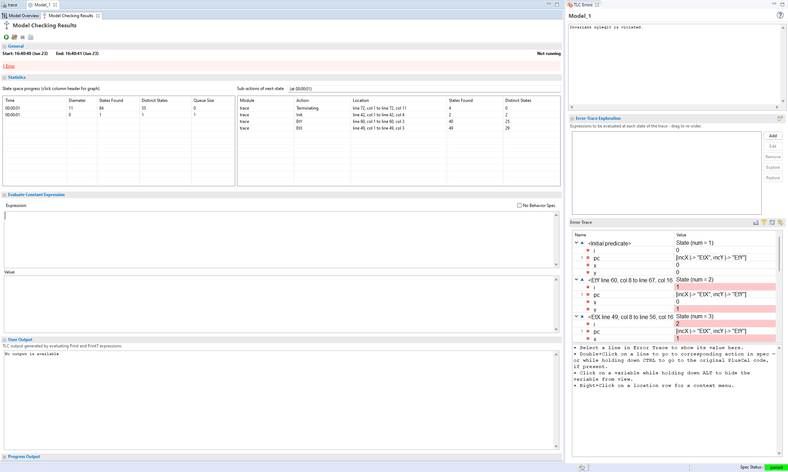
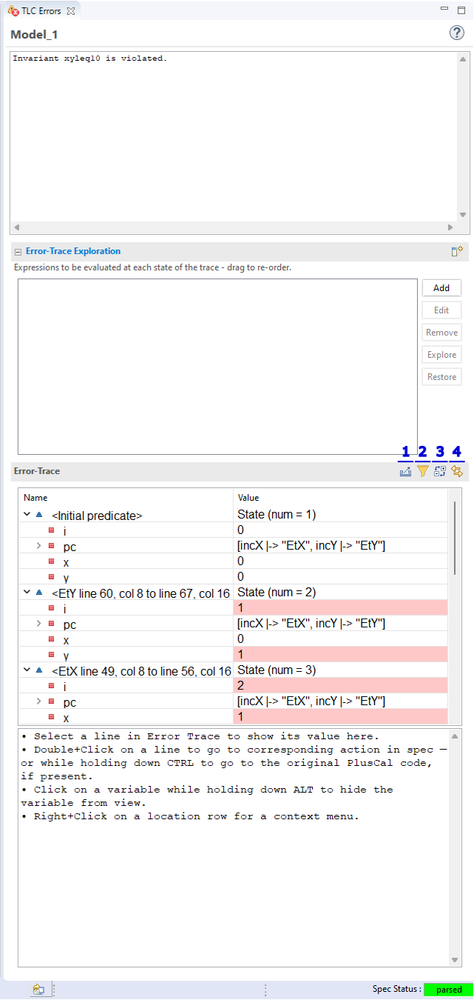
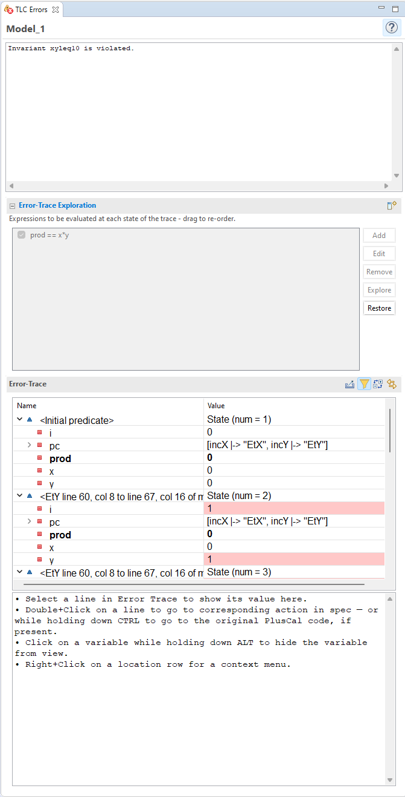

.. role:: btn

.. _topic_toolbox:

###########################
Using the Toolbox
###########################

The toolbox has a number of power-user tools to make using it easier.

Error Traces
==============

Let's create a simple spec to look at how the error trace works. This doesn't need to do anything interesting, just produce an error trace we can use.

.. spec:: topics/trace.tla

If you run this with ``INVARIANT xyleq10``, then you should get an error trace like this:

By this point you're probably familiar with the basics of the error trace: the each dropdown is a single step. Values in red are variables that changed that step. If the variable is a function, it can be expanded to see which keys changed specifically.

The rest of the trace features aren't exactly *hidden*, but they aren't really advertised either.

Error Trace Information
------------------------

Here's a quick markup:

1. Clicking on this copies the error trace as a TLA+ struct. The head toolbox dev is currently working on a feature to also copy it as a JSON, but that's not done yet.
2. Clicking this lets you filter out variables from the error trace (such as :doc:`aux-vars`). You can also hide all unchanged variables in each step.
3. Expands and closes all the trace steps. Good for getting a quick overview of the action flow.
4. When toggled, clicking on an action line will automatically jump to that action in the spec. 

There are also things you can do by clicking on the states and values:

- Alt-clicking a variable hides it from the trace. To re-show it, click the filter button again. 
- Double-clicking an action jumps to the corresponding spec code. Ctrl-doubleclicking jumps to any corresponding pluscal label.
- Right-clicking an action lets rerun the same model with that action's state as the initial state.

.. _trace_explorer:

The Trace Explorer
------------------------

The last and most complex feature of the error panel is the "Error-Trace Exploration" pane. Any expression added to this pane is evaluated at every state of the error trace, and the results shown. For example, if I add ``prod == x * y`` and then click the :btn:`Explore` button, ``prod`` will show up in the error trace.

To go back to the original trace, click :btn:`Restore`.

The explorer is a very powerful feature. Any operators added to it can be used in other explorer expression, ie ``prod > x`` is a valid expression. Additionally, you can place `primed values <prime>` in it, too! Remember, ``x'`` is the value of x in the *next* state. This goes for operators, too: ``prod' = x' * y'``.

Finally, we can test entire actions. An action is true if it accurately describes the next state.

.. figure:: img/error_trace_action.png
  
  Adding an action to error trace 

The trace explorer is a powerful tool to debug specs, and I'd recommend spending some time getting familiar with it.

.. seealso::

  `ALIAS <ALIAS>`
    ``ALIAS`` gets you some of the same benefits if you're instead running TLC from the command line.

Model Configuration
========================

On the Model Overview page of a model, there are three pages of configuration values. The most useful ones are covered here. 

This explanation is **not** comprehensive. More comprehensive notes can be found in the toolbox help files.

Additional Spec Options
-----------------------

.. _state_constraint:

State Constraint

  TLC will ignore any states of the model that don't satisfy the state constraint. For example, take this spec:
  
  ::

    EXTENDS Integers
    VARIABLE x

    Init == x = 0
    Next == x' = x + 1
    Inv == x < 10
    Spec == Init /\ [][Next]_x

  Normally, running this with ``INVARIANT Inv`` will make this fail. But if you add the state constraint ``x < 5``, then it passes with six states found. States where ``x >= 5`` will be discarded and no new states will be found from them.

  Invariants **will** be checked first, though, before the state is discarded. This means that if we change the state constraint to ``x < 10``, it will fail. The state constraint only prevents TLC from searching from new states *from* the discarded state.

  Liveness invariants can't be checked when the state constraint is active.

  .. tip:: State constraints are a good way to bound :ref:`unbound models <topic_unbound_models>`.

.. _action_constraint:

Action Constraint

  Similar to a state constraint, except it's an action. In the above spec, you can write ``x' > x`` to only explore states where x increases.

Definition Override

  Here you can replace the definitions of some operators with custom ones. For example, you can add the definition override ``Int <- 1..10``. This is mostly often used by people who want say that a variable starts as "any integer" but limit it to a finite set for model checking.

Additional TLC Options
-----------------------

.. todo:: {CONTENT} remote checking

Worker threads

  How many workers to distribute TLC checking across. By default, this is the number of cores. Using fewer threads will (generally) make TLC take longer and use fewer CPU resources. Using one thread will guarantee a deterministic model checking across runs, which may be useful if you're using print statements.

Fraction of memory

  How much memory TLC can use for checking. If the model exceeds this limit then TLC will start writing found states to disk, significantly increasing model-checking time.

  Note that TLC needs to preallocate all of the memory before it starts model checking, and then free it afterwards. For small enough models and large enough computers, allocation time can exceed the model runtime! 

.. _view:

View

  This one's dark magic and should be treated *very* carefully. Normally TLA+ distinguishes states by using all variables. If you define a ``VIEW`` expression, then that becomes the criteria TLC uses instead.

  For example, let's say you have two variables, x and y. The default VIEW would be ``<<x, y>>``. If you instead wrote ``VIEW x``, any two states with the same x will be treated as the same state, *regardless of the value of y*. 

  Used wisely, this can be useful in optimizing models. Used poorly, it can completely wreck your spec. 

Depth-first
  Normally TLC does a breadth-first search. This switches it to instead do a depth-first search. This is useful if you expect an invariant violation to be common-but-deep in the behavior. It's also a good way to check parts of unbound models, as you can specify a maximum depth to check.

Simulation Mode
  In this mode, TLC will generate random traces up to the maximum length of trace. It will not check liveness.

  Simulation mode runs never stop, even if they've exhaustively checked the state space. You have to end them manually.

Profiling
  Two types of profiling are available. "Action Enablement" records how often each partiuclar action was called. This is shown in the model checking results, under statistics. You can use this to check if an action is never enabled, in which case you have a bug in your spec.

  "On" does full profiling: how often each operator is called, how often each branch of an expression was used, and how much each operator cost to invoke. You can use this to help with optimizing models.

  (I plan to write a topic on optimizing model checking. When that happens I'll try to cover profiling in more detail.)

Visualize state graph
  Requires `graphviz`_. Generates a directed graph after the end of model checking. This can be useful for understanding small state spaces. But for large state spaces you're better off `dumping <dump>` the output yourself and pruning the graph or loading it into something like `Gephi`_.

.. _toolbox_tlc_cl:

TLC command-line parameters
  You can pass additional command line parameters to TLC that aren't exposed in the toolbox GUI. See `here <tlc_options>` for more information on what you can pass in.

.. _toolbox_misc:

Misc Features
================

- ``ctrl+space`` will start autocompletion.
- Pressing ``F3`` on a module name will jump to its definition.
- In the right click menu, there's an option to "translate pluscal automatically", which translates the spec on every save. This will raise an error if your spec isn't pluscal, though.

.. _graphviz: https://graphviz.org/

.. _Gephi: https://gephi.org/
